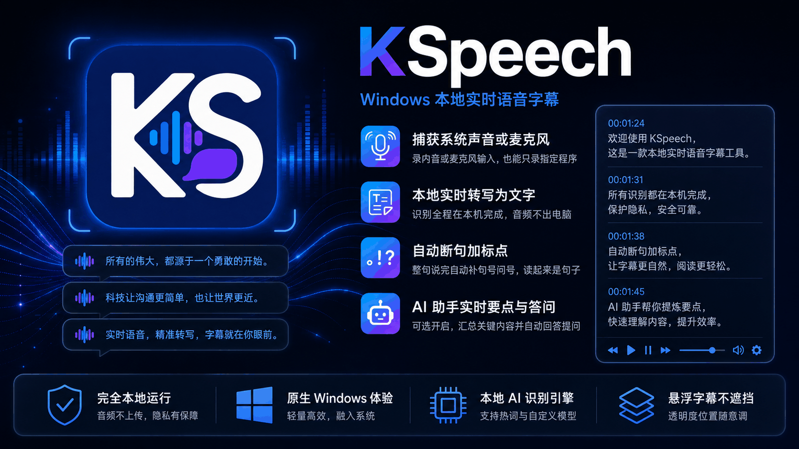
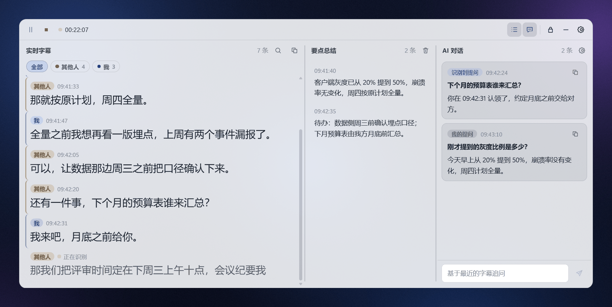
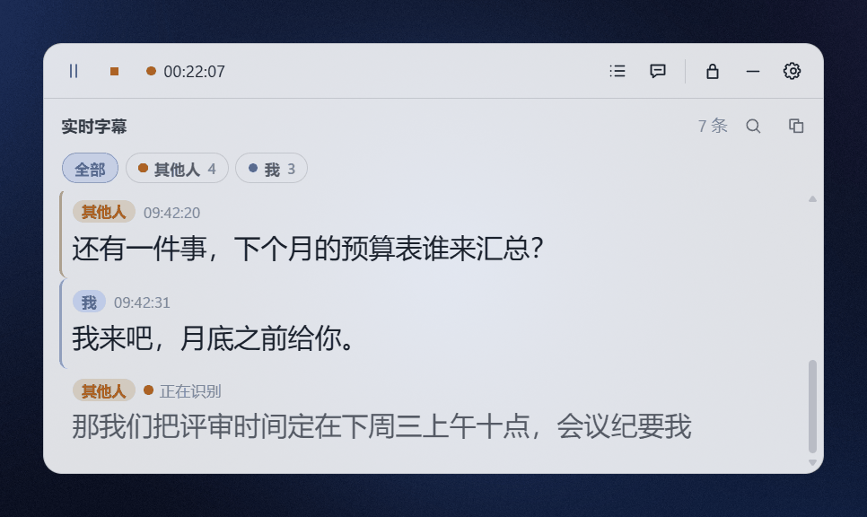
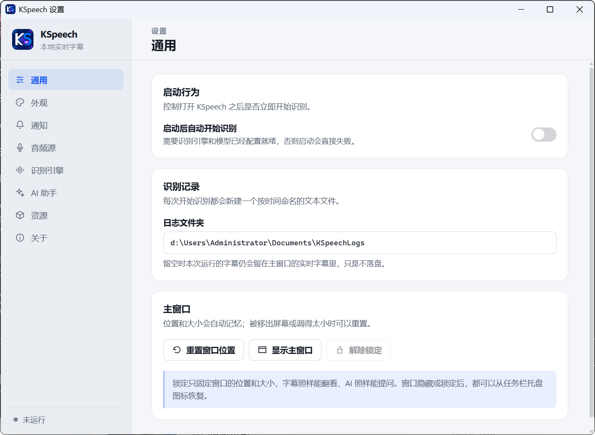
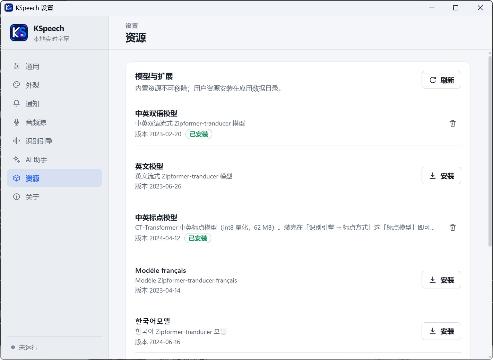

# KSpeech

English · [简体中文](README.md)



> Turns whatever your PC is playing, your microphone, or even one chosen program's audio into **punctuated** captions floating on screen. Recognition runs entirely on your machine; the audio never leaves it.

KSpeech is a rewrite of [TMSpeech](https://github.com/jxlpzqc/TMSpeech): captions, settings, history, audio capture, job scheduling and resource management were all reimplemented in **Go + Wails 3 + Vue 3**, with automatic punctuation, an AI assistant and a complete release pipeline added on top. What ships is a ~12 MB executable plus a few native inference DLLs — **no .NET runtime required**.

> **The interface is Simplified Chinese only.** This document spells out every menu path in English with the Chinese label beside it, so it can be followed against the actual UI. Recognition itself is model-driven and works for whatever language the model was trained on: the marketplace offers Chinese, English, bilingual Chinese-English, French and Korean models.

Keywords: speech to text, real-time captions, meeting transcription, floating subtitles, transcript history, live meeting notes, live Q&A

## What this rewrite changed and added

Upstream is a .NET + Avalonia implementation. This version replaces the whole application with Go + Wails 3 + Vue 3, and the rewrite added:

- **Automatic punctuation.** Streaming models emit bare text; KSpeech appends a full stop or question mark once a sentence is finalized. Spend a little more memory on the CT-Transformer punctuation model and it will also break long sentences with commas.
- **Captions as a message stream you can scroll back through.** Every finished sentence stacks up like a chat log, with the sentence being spoken hanging at the bottom. Scrolling up pins the view instead of being yanked away by new sentences, and a "back to latest" button returns you.
- **An AI assistant** (optional, off by default). Rolling key-point summaries, automatic answers to questions heard in the captions, and the provider's own hosted web search.
- **Per-process capture.** Besides global system loopback and the microphone, you can record just one PID and its children (Application Loopback).
- **One window for everything.** Live captions and history on the left, AI key points in the middle, AI chat on the right; the panes drag to resize and collapse individually. The window is small by default and resizes freely; locking pins it in place while the content stays usable.
- **Multiple audio inputs, told apart by speaker.** Microphone and system audio can be captured at once: each input runs its own recognizer, the message stream colours and labels by speaker, one speaker can be filtered on, and the assistant knows which lines were yours.
- **Transactional model installs.** SHA-256 verification, download and extraction size limits, path-escape and symlink protection, staged then atomically swapped, rolled back as a whole on failure, index forced over HTTPS.
- **Configuration that survives damage.** If the config is corrupted or half-written when power is cut, KSpeech first tries the previous version, otherwise quarantines the bad file and starts from defaults — and says on screen what happened.
- **A complete release pipeline.** Atomic publish script plus an Inno Setup installer (per-user install, no administrator rights, installs WebView2 if missing); icons and installer artwork are exported from the source images by one script.
- **Nearly 200 Go tests** covering job scheduling, the configuration store, resource transactions, all three recognizers and the AI assistant, with a clean `go vet`. The release build runs the test suite under both the default and the native build tags.

Unchanged: still built on [sherpa-onnx](https://github.com/k2-fsa/sherpa-onnx/) streaming models, and still using upstream's flat configuration keys, plugin key escaping and external-command protocol — existing model resources work as they are.

## What it is for

- Doing something else during a meeting: scroll back a couple of screens when your name comes up, and with the assistant on, the key points and a ready answer are in the same window.
- Adding live captions to a lecture, stream or foreign-language video that has none — capturing only that player's audio if you like.
- Keeping a record while you talk: captions are searchable, copyable, and can be written to a log folder automatically.

## Features

- **A transparent always-on-top three-pane window**: frameless, resizable from every edge, position and size remembered. It can hide to the tray and it can be locked (locking only pins the window — captions still scroll and the assistant still answers).
- **Three audio sources, several at once**: global loopback of the default playback device (records the mix, even while the device is muted), the microphone, and one process plus its children (needs Windows 10 build 20348+). Each input gets a name (我 / 其他人 — "me" / "others" by default), and the message stream colours and filters by speaker.
- **Three recognition engines**: Sherpa ONNX (streaming, CPU), Sherpa NCNN (for the older seven-file models), and an external command recognizer (your own program captures audio and prints captions).
- **Automatic punctuation**: the default rule-based pass has no dependencies and closes each sentence with a full stop or question mark; the sherpa-onnx Chinese-English CT-Transformer model can be attached to add commas inside sentences too.
- **A bundled hotword list and number normalization**: 395 Chinese-English hotwords (rail transit, AI, programming languages, technology terms) plus the official ITN rule file, wired up on first launch — proper nouns come out right and "二零二五" is written as 2025.
- **A scrollable caption stream**: the full transcript of the session stays in the left pane, searchable with highlighting, filterable by speaker, copyable whole or line by line, optionally written to a log folder.
- **AI assistant (optional, off by default)**: point it at your own OpenAI-compatible endpoint; the middle pane accumulates key points and the right pane answers questions heard in the captions or typed by you.
- **A model marketplace**: download, update and remove models, verified and rolled back throughout.
- **Notifications**: keyword alerts and error notifications through native Windows notifications.
- **Light and dark themes**: the interface follows the system. Caption font, size, colour, shadow and alignment, plus the panel background and hover highlight, are all configurable. When the chosen text colour would be unreadable on the current theme's panel, captions fall back to the theme's own colour and the settings page explains why.

## The interface

**Main window**: a frameless frosted panel floating above everything else. A control bar on top (start / pause / stop, timer, collapse the key-point pane, collapse the chat pane, lock, hide, settings), and three panes below it:



- **Left — live captions (实时字幕)**: each finished sentence stacks downwards like a chat log, with the sentence in progress hanging at the bottom marked 正在识别 ("recognizing"). Scrolling up pins the view and a "back to latest" button appears at the bottom right. The search button filters and highlights in place; with several audio inputs a row of speaker filters appears above (我 and 其他人 in the screenshot come from the microphone and from system audio). `Ctrl+A` selects the whole transcript. The full stops and question marks are appended once each sentence is finished.
- **Middle — key points (要点总结)**: what the assistant has distilled so far, by default every 90 seconds.
- **Right — AI chat (AI 对话)**: questions heard in the captions are answered automatically, and the box at the bottom takes follow-ups at any time.

The dividers between panes drag to resize, and both side panes collapse from the control bar. A window too narrow to hold a pane folds it away and brings it back when there is room again. Collapse both and shrink the window and you are back to a plain floating caption box:



Locking only fixes the window's position and size — captions still scroll, the assistant still answers. Once hidden, the tray icon brings it back.

**Settings**: category navigation on the left, grouped cards on the right; changes save immediately and echo 已保存 ("saved"). Caption fonts and colours live under 外观 (Appearance); engines, models, hotwords and punctuation under 识别引擎 (Recognition engine).



**Model marketplace**: download, update and remove models under 资源 (Resources), with SHA-256 verification, safe extraction and rollback on failure.



## Install and run

From the [Releases](https://github.com/kangzyz/KSpeech/releases) page:

- `KSpeech-<version>-win-x64-setup.exe` — installer. Installs per user into `%LOCALAPPDATA%\Programs\KSpeech` by default, needs no administrator rights, and installs the WebView2 runtime if it is missing.
- `KSpeech-<version>-win-x64.zip` — portable. Unpack and run `KSpeech.exe`.

**Neither package contains a speech model.** After the first launch, download a streaming model under Settings → Resources (设置 → 资源) and select it under Settings → Recognition engine (设置 → 识别引擎). A fresh install deliberately does **not** start recognition automatically, so it cannot fail on a missing model; once configured, turn on 启动后自动开始识别 ("start recognizing on launch") under Settings → General (设置 → 通用).

Requirements: Windows 10 2004 (10.0.19041) or newer, x64. Per-process capture additionally needs Windows 10 build 20348+.

## Automatic punctuation

Streaming models output bare text. KSpeech adds the punctuation **after a sentence is finalized**, so the in-progress caption is left alone and does not jitter while you speak. Switch modes under Settings → Recognition engine → 标点符号 (Punctuation):

| Mode | Effect | Cost |
| --- | --- | --- |
| Rules (default) | Closes a sentence with 。 or ？, switches between full-width and ASCII marks, never doubles up existing punctuation | None, nothing to download |
| Punctuation model | Also breaks sentences with commas | Needs the sherpa-onnx Chinese-English CT-Transformer model, another copy of it in memory and a little CPU |

For the model mode, point the path at the `model.onnx` from [sherpa-onnx-punct-ct-transformer-zh-en-vocab272727-2024-04-12](https://k2-fsa.github.io/sherpa/onnx/punctuation/pretrained_models.html). If the model cannot be read, KSpeech falls back to the rules, says so on screen, and does not interrupt the run.

If sentences run too long, 整句最长字数 ("maximum sentence length", default 80 characters) on the same page lowers the point at which a sentence is forced to end.

## The AI assistant: live key points and answers

Fill in your own endpoint under Settings → AI 助手 (AI assistant). Anything that speaks OpenAI's `/chat/completions` works: DeepSeek, Qwen (compatibility mode), Zhipu, Moonshot, OpenRouter, and local servers such as Ollama, LM Studio or vLLM.

```text
API address: https://api.deepseek.com/v1      # up to /v1; KSpeech appends /chat/completions
API key    : sk-xxxxxxxx                      # may be empty for a local model
Model name : deepseek-chat                    # summaries and answers are short; a small model is enough
```

Use 测试连接 ("test connection") to confirm it works, then turn on the switch at the top. Once enabled:

- **Key points**: every so often (90 seconds by default, adjustable from 15 to 1800) whatever was said in that window is condensed into at most three points, timestamped and accumulated in the middle pane; stopping recognition triggers one final summary. A stretch of small talk produces nothing.
- **Live answers**: when a question appears in the captions (`？`, 吗, 为什么, 谁负责, how/why…), the last 30 sentences of context go out with it and the model returns an answer you can say out loud; automatic answers are at least 8 seconds apart. The box at the bottom takes manual follow-ups, and follow-ups keep the thread — earlier turns travel with the question, with older ones compressed into a rolling summary so a long conversation does not keep growing the request.
- **Provider-hosted tools**: on by default. Answers declare the provider's own web search, which is what makes a question like "which day was that launch event" answerable beyond the model's training cut-off. The provider runs and bills for the tool.
- **Extra background**: naming the meeting's topic, its participants and how proper nouns are spelled, under 高级 (Advanced), noticeably reduces misreadings caused by homophones.

The provider is identified from the API address, falling back to the model name when the address is unfamiliar (which is how relay gateways are recognized):

| Provider | Hosted tools on `/chat/completions` |
| --- | --- |
| OpenAI, Zhipu GLM, Kimi (Moonshot), MiniMax | Web search (declared in `tools`) |
| Qwen (Bailian), ERNIE (Qianfan), Tencent Hunyuan, Google Gemini, OpenRouter | Web search (a request parameter) |
| DeepSeek, Doubao (Volcengine Ark), xAI Grok, Anthropic Claude, local models | None — their official endpoints offer no hosted tool over this protocol |

If an endpoint rejects the tool declaration, KSpeech retries once without it, so the answer still arrives, and the chat pane notes that this one did not search.

On privacy and cost:

1. **Off by default.** While it is off, no model request is ever made; recognition itself always runs locally.
2. Once on, only **finished caption sentences** are sent. In-progress results and audio never leave the machine.
3. With hosted tools on, the provider may take your question to a search engine. Turn off 模型内置工具 ("provider-hosted tools") if you would rather it did not.
4. The API key is stored in clear text in `%APPDATA%\KSpeech\config.json`. Use a dedicated key with a spending limit.
5. Public addresses must be `https`; `http` is only allowed for local and intranet servers such as Ollama.
6. Cost follows how much is said: shorter summary intervals and more context sentences mean more tokens. A failed request is reported in the chat pane and retried at the next interval, not in a loop.

## Audio sources and recognition engines

All three sources produce `float32 / 16 kHz / mono`. Global loopback records the system mix and keeps recording while the playback device is muted; per-process capture uses Windows Application Loopback and can follow one player or meeting app together with the child processes it spawns.

Several inputs can be enabled at once under Settings → 音频源 (Audio sources). The typical pair is **microphone + system audio**: the microphone records you, system audio records everyone else in the meeting. Each input has its own speaker name (我 and 其他人 by default, up to 12 characters; leave it empty for no prefix), the message stream colours by speaker and prefixes every line, one speaker can be shown alone, and the log file is written as `15:04:05 我: …`. Two things to know:

- Each input **runs its own recognizer**, so memory and CPU roughly multiply by the number of inputs. When the machine cannot keep up, one input drops a fragment of audio and says so once; recognition does not stop.
- **Wear headphones.** On speakers, your microphone records the other side a second time and the same sentence is attributed to two people.

Of the built-in engines, **Sherpa ONNX** is the main one (streaming Zipformer transducer, CPU); its settings page exposes the decoding method, the hotwords file and its weight, the ITN rule file and the maximum sentence length. **Sherpa NCNN** exists for the older seven-file models.

### Hotwords and number normalization

Two files ship beside `KSpeech.exe` and are filled into Settings → Recognition engine on first launch. Clear the field if you do not want one (it will not be filled in again):

- `hotwords.txt`: 395 hotwords covering rail transit (屏蔽门, CBTC, ATO, 一号线…), AI (大模型, RAG, TRANSFORMER, PYTORCH…), programming languages (PYTHON, GOLANG, RUST…) and technology terms (KUBERNETES, GRPC, 灰度发布…). Hotwords only apply under `modified_beam_search`, which is therefore what a fresh install uses — it costs more CPU than greedy search, so on a busy machine simply switch the decoding method back to `greedy_search`: the hotwords stop applying but the path stays in the settings, and switching back restores them.
- `itn_zh_number.fst`: k2-fsa's official Chinese number rules, writing 二零二五 as 2025.

Three hard rules when adding your own words. Breaking one raises no error, it just does not work (the first one is worse than that):

1. **No comments.** A line starting with `#` is parsed as a keyword threshold and takes the recognition process down with it.
2. **Latin words must be upper case**, because these models' BPE vocabularies are; the model directory also needs `bpe.vocab` (bilingual models have it, Chinese-only models do not, and the latter skip Latin entries).
3. **No digits and no punctuation.** Digits are not in the model's vocabulary — write 五号线, not 5号线, and let ITN render the digits. A line containing `GPT-4`, `C++` or `CI/CD` is discarded whole.

Appending ` :3.0` to a line sets that word's weight, overriding the global one. Check your list with the script in this repository after editing:

```powershell
python .\scripts\check-hotwords.py .\assets\hotwords.txt "$env:APPDATA\KSpeech\plugins\<resource>\<model directory>"
```

To keep your own list from being overwritten by an upgrade, copy it into `%APPDATA%\KSpeech\` and point the setting at that copy.

### External command recognizer

To use your own recognition stack, pick 外部命令 ("external command") under Settings → Recognition engine. KSpeech starts the program and arguments you give it, treats its standard output as the caption stream, and keeps draining standard error (optionally into a log file; if that file cannot be written it only warns and recognition continues).

The protocol has exactly one rule: **a single newline updates the current sentence, two consecutive newlines finish it.** Only finished sentences enter the history, so the model is free to correct earlier output.

```text
一二
一二三四
一二三四五六七

七六五四三二一

```

`external_recognizer/` holds three working implementations: `streaming-with-endpoint-detection.py` (sherpa-onnx streaming plus endpoint detection), `simulate-streaming-sense-voice.py` and `simulate-streaming-funasr-nano.py` (offline models plus Silero VAD, decoding a whole segment once speech ends, so captions arrive in one piece after a pause). Usage and model downloads are documented in the scripts' own arguments under [external_recognizer/](external_recognizer/).

A few notes:

- The child process captures its own audio; the audio source settings do not apply to it.
- Separate arguments with spaces, and quote any argument that contains one (a path, typically).
- A `.bat` or `.cmd` program is started through `%ComSpec% /d /s /c`, so prefix commands with `@` to suppress echo and do not end with `pause`.

## Models

Both the marketplace index and the models are hosted on GitHub. Because direct connections are unreliable in some regions, KSpeech follows the Windows system proxy (the manual proxy under Settings → Network & Internet → Proxy), the same one your browser uses; environment variables such as `HTTPS_PROXY` take precedence. A refresh timeout simply means it could not connect — installed resources are unaffected.

Recognition quality is mostly the model's doing. The marketplace under Settings → Resources offers five sherpa-onnx streaming models (Chinese, English, bilingual Chinese-English, French, Korean) and one Chinese-English punctuation model (CT-Transformer int8, 62 MB). The index lives in this repository under [marketplace/](marketplace/) and every entry carries a SHA-256. Once the punctuation model is installed, choose 标点模型 ("punctuation model") under Recognition engine → Punctuation and pick it from the dropdown; no path to type. For any other model, download one from [sherpa-onnx's streaming model list](https://k2-fsa.github.io/sherpa/onnx/pretrained_models/online-transducer/zipformer-transducer-models.html) and point the encoder / decoder / joiner / tokens paths at it directly.

## Configuration and data directories

| What | Where |
| --- | --- |
| Configuration (including the assistant's endpoint and key, in clear text) | `%APPDATA%\KSpeech\config.json` |
| Downloaded models and extensions | `%APPDATA%\KSpeech\plugins\` |
| Transcript logs (default) | `Documents\KSpeechLogs` |

If the configuration file is corrupted or half-written when power is cut, KSpeech first tries to restore the previous version; failing that it quarantines the bad file, starts from defaults, and explains on screen what happened rather than crashing.

## Building from source

Requirements: Windows 11 x64, Go 1.25+, Node.js and pnpm 11.16.0. Wails is pinned to `v3.0.0-beta.7`.

```powershell
pnpm --dir .\frontend install --frozen-lockfile
pnpm --dir .\frontend run build
go test .\... -count=1
go vet .\...
go build -o .\build-dev\KSpeech.exe .
```

A plain `go build` uses the Sherpa stub **without native inference**, which is what you want for interface, configuration and external-recognizer work. The production package with native recognition, and the installer, both need PowerShell 7:

```powershell
.\scripts\build-windows.ps1 -Version 0.1.0 -Commit (git rev-parse --short HEAD)
.\scripts\build-installer.ps1 -Version 0.1.0
```

The production build needs `CGO_ENABLED=1` and MinGW-w64 x64 GCC. It places the sherpa-onnx / sherpa-ncnn Windows DLLs and the Microsoft VC++/OpenMP runtimes they need into `publish\`, and Inno Setup 6.3+ turns that into an installer under `build\installer\`. Icons, installer artwork and the README banner are exported from `imgs\` by `scripts\make-brand-assets.py`. See [Develop.md](Develop.md) (Chinese) for the details.

## Current status

The three-pane main window and the settings window, the tray, all three audio sources, all three recognition engines, automatic punctuation, configuration management and transactional resource management all work. The native production package builds and smoke-starts on the development machine, and both ONNX and NCNN passed real inference tests with the official 14M models and a Chinese WAV file. **Verification against real captured audio, the CT-Transformer punctuation model on real hardware, Vulkan GPU acceleration and acceptance on a clean machine are still outstanding** — the full list is in [the Go rewrite notes](docs/go-rewrite.md) (Chinese) and the plan is in [ROADMAP](ROADMAP.md).

## Feedback and contributing

Whether it works well for you or you hit a wall, open a [Discussion](https://github.com/kangzyz/KSpeech/discussions/new) or an [issue](https://github.com/kangzyz/KSpeech/issues/new); model recommendations and examples where the punctuation rules get it wrong are especially welcome. If you write Go or Vue, pull requests are welcome too — the repository layout and where changes belong are described in [CLAUDE.md](CLAUDE.md) and [Develop.md](Develop.md) (both Chinese).

## Acknowledgements

- [TMSpeech](https://github.com/jxlpzqc/TMSpeech) (jxlpzqc, am009): this project's predecessor. Its configuration layout, external-command protocol and original product shape all come from there.
- [sherpa-onnx / sherpa-ncnn](https://github.com/k2-fsa/sherpa-onnx): local recognition and the punctuation model.
- [Wails](https://wails.io/): the Go desktop shell.

## Licence

[MIT](LICENSE), keeping upstream's copyright notice.
