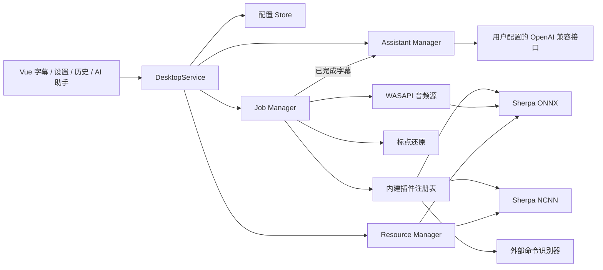

# KSpeech Go 重构说明

## 目标与边界

新实现以 Windows 11 x64 为首发平台，业务逻辑使用 Go，桌面壳使用固定版本的 Wails 3，界面使用 Vue 3/TypeScript。Go 入口使用的图标已经迁到根目录 `assets/`，不再依赖旧源码树。旧 C# 源码树不在本仓库里，需要审计历史行为时看上游 [TMSpeech](https://github.com/jxlpzqc/TMSpeech) 的 `src/`。

## 命名与标识

- Go 模块路径为 `github.com/kangzyz/KSpeech`，前端绑定生成在 `frontend/bindings/` 下的同名目录。
- 用户数据目录为 `%APPDATA%\KSpeech`（配置与已安装资源），默认识别日志目录为 `我的文档\KSpeechLogs`。
- 插件完整键中的模块 ID 前缀为 `KSpeech.*`；随包 `default_config.json` 必须与之一致，否则会因为找不到已注册的音频源或识别引擎而启动失败。
- 前后端事件名为 `kspeech:state` / `kspeech:live` / `kspeech:notification` / `kspeech:assistant`；资源事务标记为 `.kspeech-*`；测试与构建环境变量为 `KSPEECH_*`；产物为 `KSpeech.exe`，CI 工件为 `KSpeech.win-x64`。
- 模块清单文件名为 `ksmodule.json`，由安装步骤 `write_module_json` 生成。
- 模型市场索引托管在本仓库 `marketplace/`，默认地址为 `https://raw.githubusercontent.com/kangzyz/KSpeech/master/marketplace/marketplace.json`。索引里每个安装步骤都带指向上游的绝对 URL（sherpa-onnx releases 或 HuggingFace），所以自建只托管这一个 JSON，模型本体仍从上游下载；全部条目都带 `sha256`。
- 安装步骤有 `download` / `extract` / `save_file` / `write_file` / `write_module_json` 五种。上游把模型打成一个压缩包时用 `extract`；像 X-ASR 那样以散文件发布、没有压缩包时用 `save_file`，它把某一步下载到的原始文件按 `savePath` 放进模块目录（`saveStep` 省略即指上一步）。`save_file` 是复制而不是改名，所以同一个下载可以被多个 `save_file` 引用，这一点与 `extract` 保留压缩包的行为一致。

## 已实现

- 双窗口 Wails 桌面壳：无边框透明置顶的三栏主窗口（实时字幕与历史 / AI 要点 / AI 对话）、独立设置窗口、托盘、窗口锁定与隐藏、位置与大小恢复。
- 配置沿用旧的扁平键与插件键结构；保存使用同目录临时文件替换。损坏或截断的主配置会先尝试恢复 `.previous`，否则隔离原字节并以默认值启动，同时在界面报告可恢复告警。
- 全新安装默认不自动开始识别，避免未安装模型时启动即失败；随包 `default_config.json` 的显式值仍优先。
- Go 插件契约与并发安全注册表；内建音频源和识别器不依赖 Windows 不支持的 Go `plugin` ABI。
- Windows 麦克风、默认播放设备全局回环，以及指定 PID 和进程树的 Application Loopback，统一输出 `float32 / 16 kHz / mono`。
- 外部命令识别器，兼容旧单换行 partial、双换行 final 协议；持续排空 stderr，支持取消、重启和进程树终止；普通 Windows EXE 原样接收旧 `Arguments` 字符串且不经过 shell，`.bat/.cmd` 通过 `%ComSpec% /d /s /c` 启动并保留原始参数后缀。
- Sherpa ONNX 生命周期、配置、模型资源解析和流式结果处理；无 `sherpa` 标签时提供明确的 unavailable stub。
- Sherpa NCNN 七文件旧配置与流式生命周期；Windows 后端直接映射官方 C API，保留旧实现的 Vulkan 请求，其他平台仍使用 CPU-only Go wrapper；无 `sherpancnn` 标签时提供 unavailable stub。
- 标点还原（`internal/punctuation`）：流式模型只输出裸文本，job 在每句定稿时补标点，识别中的 partial 保持原样。默认的规则实现只判断句末的句号或问号（含中英文问句判定），零依赖；可选的 sherpa-onnx CT-Transformer 离线标点模型还会在句中断句加逗号，只在带 `sherpa` 标签的构建里编译，模型读不出来时退回规则实现并发出警告而不是中断本次识别。
- 资源市场、本地扫描、SHA-256、HTTPS 默认策略、下载/安装体积上限、ZIP/TAR 系列安全解压、路径逃逸与 reparse 防护、暂存安装、更新回滚与移除隔离。
- 识别历史、日志、敏感词和错误通知；UI 会话历史保留最新 2000 条，实时字幕走 30 Hz 轻量合并事件，日志文件仍完整写盘，Windows 通知走 Wails 原生通知服务。
- 可选 AI 助手（`internal/assistant`）：用户自填 OpenAI 兼容接口，默认关闭；只消费 job 已完成的整句，按间隔滚动生成关键要点，命中问句时自动作答，并支持手动追问。端点在保存时即校验，公网强制 https，`http` 仅放行本机与内网；单次汇总互斥、并发回答上限 2、自动回答冷却 8 秒、失败重启间隔而不是逐句重试；转写、要点与问答均有条数上限。回答请求会按 `tools.go` 的目录声明服务商自己托管的工具（各家的联网搜索），服务商由端点主机判断、认不出时退回模型名；Moonshot 的 `$web_search` 需要把工具调用原样回传，接口拒绝工具声明时自动去掉工具重试一次。
- 全新界面：统一设计令牌、深浅双主题跟随系统；主窗口是一块毛玻璃面板，顶部控制栏（开始/暂停/停止、计时、收起要点栏与对话栏、锁定、隐藏、设置）加三栏正文——左栏是可回翻的字幕消息流（搜索高亮、说话人筛选、逐条复制、跟随最新与「回到最新」），中栏是 AI 要点，右栏是 AI 对话；栏宽可拖动、窄窗自动折叠；设置窗为分类导航 + 卡片分组，外观页的预览直接画出消息流在毛玻璃上的样子。两个窗口的加载、切换、锁定/隐藏/折叠交互与控制台无异常已通过 WebView2 远程调试端口验证。
- Windows x64 原生生产构建已在本机使用 MinGW、`CGO_ENABLED=1` 和 `production,sherpa,sherpancnn` 标签通过；发布目录包含 Go 模块提供的 2 个 ONNX DLL、4 个 NCNN DLL，以及经过 PE32+/x64 和复制哈希校验的 4 个 Microsoft VC++/OpenMP 运行库。完整脚本已从入口执行到原子发布，成品已完成两窗口业务 DOM 加载和退出码 0 的优雅退出冒烟；最终仍须在干净机器证明依赖完整。
- Sherpa ONNX 与 NCNN 已使用官方 14M 中文流式模型和同一段 16 kHz WAV 完成真实 native 推理；两者均产生 partial/final，最终文本命中预期中文短语。真实测试必须把匹配的 DLL 放在测试 EXE 同目录，避免系统目录中的其他 ONNX Runtime 被优先加载。

## 兼容约定

- 插件完整键沿用旧 `PluginManager.GetFullKey` 的转义规则：模块 ID 中 `:` 转为 `::`，`.` 转为 `:`，再拼接 `!<plugin-id>`。规则未变，只是模块 ID 前缀改为 `KSpeech`。
- 插件配置键仍为 `plugin.<fullKey>.config`，值通常是 JSON 字符串；麦克风设备和目标进程保持旧纯字符串形式。
- 旧 .NET DLL 插件无法由 Go 进程直接加载。首版采用内建注册表；第三方扩展应迁移到版本化子进程协议，或单独提供遗留 .NET sidecar。
- 资源页会显示旧 .NET 插件的兼容提示，但不会允许安装一个主程序无法加载的 DLL 包。
- 用户资源目录可覆盖同 ID 的内置资源；内置资源不可移除。

## 尚未达到发布验收的项目

1. 指定进程回环后端已完成激活/初始化/停止冒烟，设置页可从当前进程列表选择目标；尚未验证真实播放程序及其子进程的音频样本内容。
2. Windows NCNN 已映射并实际发起 Vulkan 请求，真实模型测试可以完成，但没有观察到 GPU compute context；当前官方 `ncnn.dll` 的导入表也未提供 Vulkan 装载证据。因此仍不能声称发生了 GPU offload，当前验收只证明 CPU 或静默 fallback 可用。
3. 需要在真实设备验证音频样本内容、设备断开/切换、静音包与长时间运行。
4. 需要在多屏/多 DPI 的干净 Windows 11 x64 机器验证透明像素、置顶、八向缩放、锁定点击穿透、托盘解锁和 WebView2 安装路径。界面重构后的深浅主题、悬停控制条与缩放表现同样需要在该环境复验。
5. `external_recognizer/` 下的 Python 文件是外部命令协议示例与测试，不属于 Go 主程序；若要求仓库零 Python，需要另行移植或移出主仓库。
6. `TestConfigureProcessRunsBatchRelativeToWorkingDirectory` 在本机失败：`cmd.exe /d /s /c ""相对路径.cmd""` 不解析带引号的相对批处理名。该问题早于改名，需要单独确认目标行为后修复。
7. CT-Transformer 标点模型只在 stub 构建下验证了配置校验与失败回退路径，尚未用真实模型在 `sherpa` 构建里跑通一次推理，也没有测过它对长会话的内存与延迟影响。

在这些项目全部通过前，不应宣称已经完成生产级全量替换。
